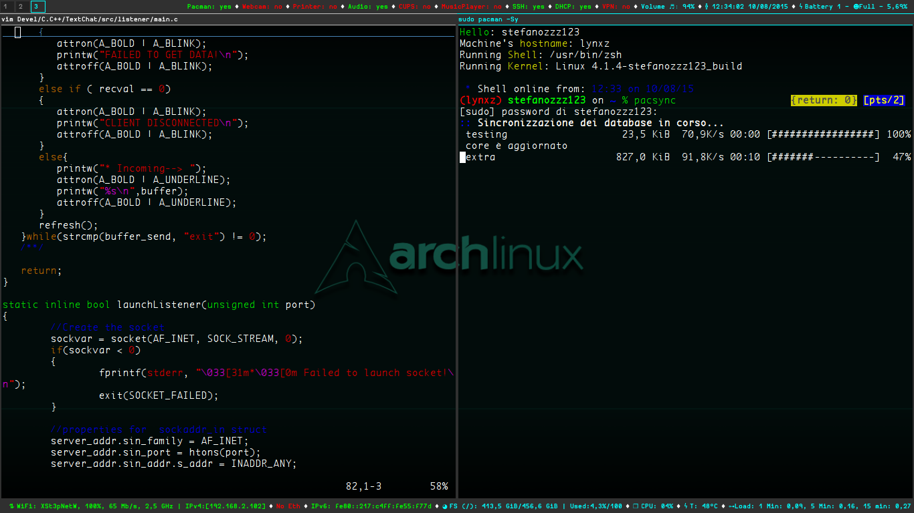

*I3INFo.md*

**NOW THIS CONFIG REQUIRES 2 BARS... COPY AND PASTE THE i3status/ CONFIGURATIONS IN /etc WITH THEIR ORIGINAL NAME**

*Tested with ArchLinux, not working with Gentoo...(w/ this config)*

#This is my i3 DE configuraton#
===============

Clean:


Dirty:



  *Find*
   
   - I3Status : *i3status/i3status.conf*
   - I3Config : *i3/config*
   - Image    : *i3/intelcpu.jpg*
  
   *Use*
   - I3Status : ```# cp i3status.conf /etc/i3status.conf``` 
   - I3Config : ```$ cp config $HOME/.i3/config```
   - Image    : Copy as above, keep its name as intelcpu.jpg 
 
   *I3Status will search for following PID*
   - DHCP : dhcpcd*.pid (/var/run)
   - VPN  : ovpn.pid (/var/run) [OpenVPN --writepid /var/run/ovpn.conf)
   - SSHD : sshd.pid (/var/run)
   - HTTPD: httpd.pid (/var/run/httpd)
   - FTPD : ftpd.pid (/var/run)
	- MOCP : pid ($HOME/.moc)

	*I3Status will also check that some files exists*
	- CUPS 
	- Webcams : /dev/video0 (Linux-kernel devices)
	- Pacman Package Manager Lock Database: db.lck 
	- Printer : /dev/usb/lp0 (Linux-kernel devices)
	- Audio device : /dev/audio (Linux-kernel devices)

   
   *I3Status "checks"*
   - Wireless / Ethernet
   - Filesystem ( / )
   - CPU w/ temp
   - Volume 
   - PIDs 
   - BATTERY (/sys/class/power_supply/BAT1 = replace 1 with yours, read config)
   - TIME 
	- PATH
	- Load
	- IPv6

	(2 bars)

   All mixed with great text symbols :P

 
   *Main colors for I3*
   
	[Previously]

   - Blue
   - Yellow

	[Now]

	- Grey
	- Aquamarine 


	**WARNING FOR KEYBINDINGS: I initialized some variables in i3 config file, you can choose many parameters**

   *Pre-setted keybindings*
   - Firefox
   - PopcornTime 
   - Thunar
   - GIMP
   - Spotify 
   - Sublime Text, Codeblocks, Eclipse, Android Studio
   - Mousepad
   - VLC 
   - Guvcview
   - GParted (gksu)
   - Grub-Customizer (gksu)
   - Power-off and reboot keybindings
   - Screenshots (scrot)
   - VirtualBox
	- Volume keys (XF86)

	*GIMP Auto-floating mode*
	*To change keyboard layout, change the variable in i3 config file*

