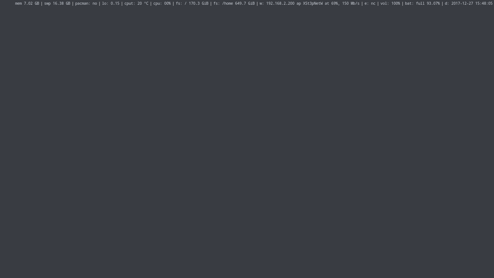
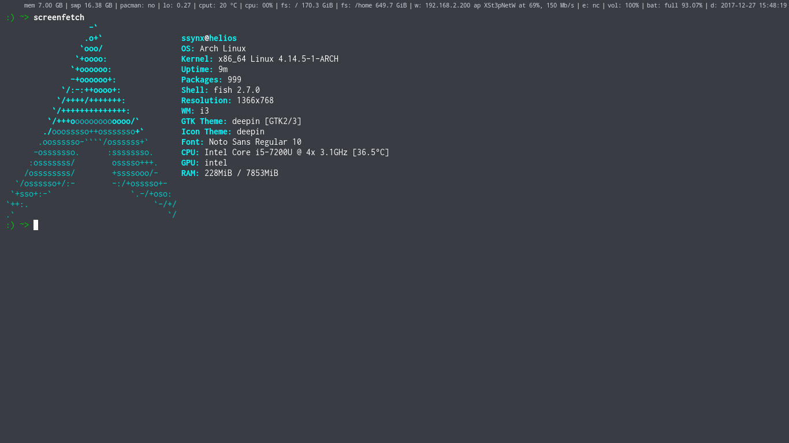
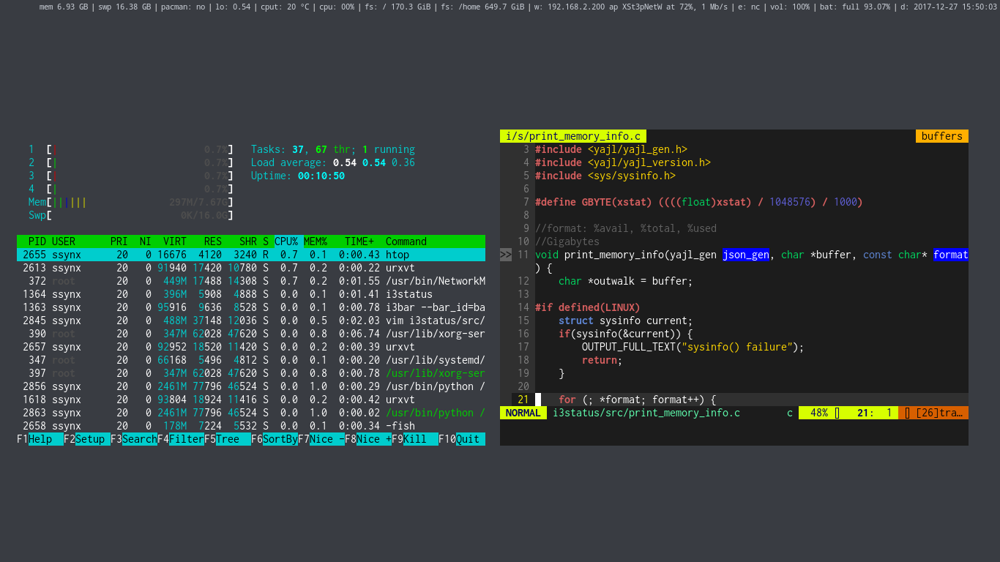

# i3wm 
This is my minimal configuration for i3wm

(Refer also to *X/Xdefaults* for urxvt configuration)

**NOTE: i3status will work only with my own fork, otherwise, 
if you don't need to show memory and swap, remove them from the i3status config file**

### Clean

### One terminal, overall workspace

### Two floating terminals

